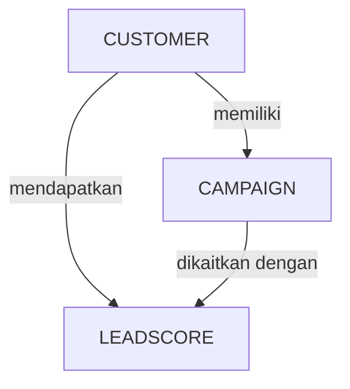

# LeadScoringPortal Database Schema Documentation

## Ringkasan

Dokumen ini memberikan dokumentasi lengkap untuk **database LeadScoringPortal** yang dibangun menggunakan PostgreSQL (atau MySQL). Skema ini mendukung prediksi **lead scoring** untuk sales perbankan, termasuk data nasabah, riwayat kampanye, konteks makroekonomi, dan hasil prediksi model.

## Daftar Isi

1. [Tabel Utama](#tabel-utama)  
2. [Riwayat Kampanye](#riwayat-kampanye)  
3. [Data Makroekonomi](#data-makroekonomi)  
4. [Hasil Prediksi Model](#hasil-prediksi-model)  
5. [Enums / Kategori Tetap](#enums--kategori-tetap)  
6. [Relasi Antar Tabel](#relasi-antar-tabel)  
7. [Indeks & Konstraint](#indeks--konstraint)  
8. [Kinerja & Best Practices](#kinerja--best-practices)  
9. [ERD Graph (Diagram Entitas Hubungan)](#erd-graph-diagram-entitas-hubungan)

---

## Tabel Utama

### Customer
**Tujuan:** Menyimpan informasi dasar nasabah.

| Kolom | Tipe | Deskripsi | Konstraint |
|:---|:---|:---|:---|
| `id` | Int / UUID | Primary key | **PRIMARY KEY**, **AUTOINCREMENT / UUID** |
| `age` | INT | Umur nasabah | **NOT NULL** |
| `job` | VARCHAR | Jenis pekerjaan | **NOT NULL** |
| `marital` | VARCHAR | Status pernikahan (married/single/divorced) | **NOT NULL** |
| `education` | VARCHAR | Tingkat pendidikan | **NOT NULL** |
| `default` | VARCHAR | Memiliki kredit macet? (yes/no/unknown) | **NOT NULL** |
| `balance` | FLOAT | Saldo rata-rata rekening | **NOT NULL** |
| `housing` | VARCHAR | Memiliki kredit rumah? | **NOT NULL** |
| `loan` | VARCHAR | Memiliki pinjaman pribadi? | **NOT NULL** |
| `created_at` | DateTime | Timestamp saat data dibuat | **DEFAULT NOW()** |
| `updated_at` | DateTime | Timestamp terakhir diupdate | Diupdate otomatis |

**Relasi:**  
- One-to-many: `campaigns`, `lead_scores`

---

## Riwayat Kampanye

### Campaign
**Tujuan:** Menyimpan detail kontak kampanye untuk setiap nasabah.

| Kolom | Tipe | Deskripsi | Konstraint |
|:---|:---|:---|:---|
| `id` | Int / UUID | Primary key | **PRIMARY KEY**, **AUTOINCREMENT / UUID** |
| `customer_id` | INT | Referensi ke `Customer.id` | **FOREIGN KEY**, **CASCADE ON DELETE** |
| `contact` | VARCHAR | Jenis kontak (cellular/telephone) | **NOT NULL** |
| `day_of_week` | VARCHAR | Hari terakhir dihubungi | **NOT NULL** |
| `month` | VARCHAR | Bulan terakhir dihubungi | **NOT NULL** |
| `campaign` | INT | Jumlah kontak selama kampanye saat ini | **NOT NULL** |
| `previous` | INT | Jumlah kontak pada kampanye sebelumnya | **NOT NULL** |
| `pdays` | INT | Hari sejak kontak terakhir kampanye sebelumnya (999 = belum pernah dihubungi) | **NOT NULL** |
| `poutcome` | VARCHAR | Hasil kampanye sebelumnya | **NOT NULL** |
| `created_at` | DateTime | Timestamp data dibuat | **DEFAULT NOW()** |

---

## Data Makroekonomi

### MacroData
**Tujuan:** Menyimpan indikator sosial & ekonomi makro.

| Kolom | Tipe | Deskripsi | Konstraint |
|:---|:---|:---|:---|
| `id` | Int / UUID | Primary key | **PRIMARY KEY**, **AUTOINCREMENT / UUID** |
| `month` | VARCHAR | Bulan indikator | **NOT NULL** |
| `emp_var_rate` | FLOAT | Tingkat perubahan tenaga kerja (kuartal) | **NOT NULL** |
| `cons_price_idx` | FLOAT | Consumer Price Index (bulanan) | **NOT NULL** |
| `cons_conf_idx` | FLOAT | Consumer Confidence Index (bulanan) | **NOT NULL** |
| `euribor3m` | FLOAT | Suku bunga Euribor 3 bulan | **NOT NULL** |
| `nr_employed` | FLOAT | Jumlah pegawai nasional (kuartal) | **NOT NULL** |
| `created_at` | DateTime | Timestamp data dibuat | **DEFAULT NOW()** |

---

## Hasil Prediksi Model

### LeadScore
**Tujuan:** Menyimpan hasil prediksi model dan skor lead.

| Kolom | Tipe | Deskripsi | Konstraint |
|:---|:---|:---|:---|
| `id` | Int / UUID | Primary key | **PRIMARY KEY**, **AUTOINCREMENT / UUID** |
| `customer_id` | INT | Referensi ke `Customer.id` | **FOREIGN KEY**, **CASCADE ON DELETE** |
| `campaign_id` | INT | Referensi ke `Campaign.id` | **FOREIGN KEY**, **CASCADE ON DELETE** |
| `predicted_y` | VARCHAR | Prediksi kelas (yes/no) | **NOT NULL** |
| `score` | FLOAT | Probabilitas prediksi | **NOT NULL** |
| `created_at` | DateTime | Timestamp prediksi dibuat | **DEFAULT NOW()** |

---

## Enums / Kategori Tetap

- `job` → "admin.", "technician", "services", "management", "retired", dll.  
- `marital` → "married", "single", "divorced"  
- `education` → "basic.4y", "basic.6y", "high.school", "university.degree", "unknown", dll.  
- `default`, `housing`, `loan` → "yes", "no", "unknown"  
- `contact` → "cellular", "telephone"  
- `poutcome` → "nonexistent", "failure", "success"

---

## Relasi Antar Tabel

- **Customer → Campaign**: One-to-many  
- **Customer → LeadScore**: One-to-many  
- **Campaign → LeadScore**: One-to-one / One-to-many (opsional)

---

## Indeks & Konstraint

- Index pada `customer_id` dan `campaign_id` untuk lookup cepat  
- Foreign key dengan **CASCADE ON DELETE**  
- Kolom enum disarankan konsisten dengan aplikasi  

---

## Kinerja & Best Practices

- Ekstraksi subset kolom `Customer + Campaign + MacroData` untuk prediksi model  
- Pastikan preprocessing di production sama dengan saat training  
- Gunakan batch insert saat menyimpan banyak prediksi sekaligus  
- Index kolom yang sering di-query: `customer_id`, `month`, `created_at`  

---

## ERD Graph (Diagram Entitas Hubungan)

